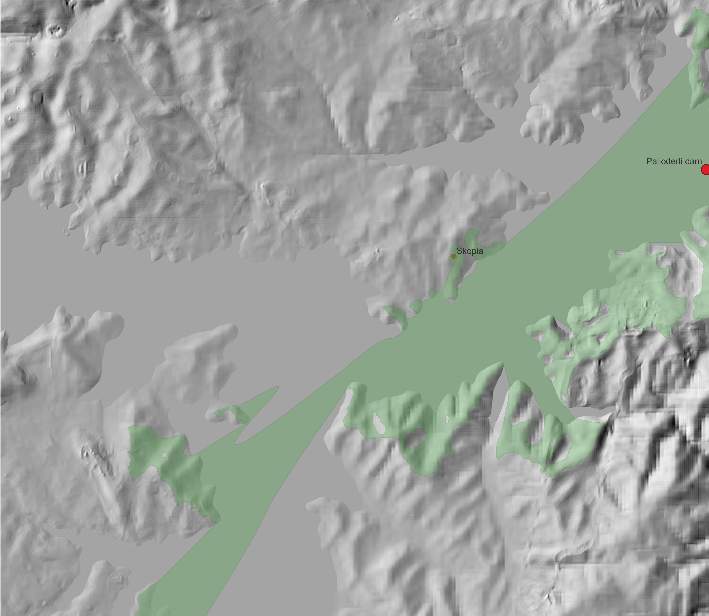

# Palioderli-Dam
This repository is the water deposit analysis of the Palioderli dam at Skopia (Greece)

## Requirements

- Docker
- GDAL

## Input Data

- DEM 4.77 meters resolution
- Position of the dam

## Processing

Download the DEM

```bash
docker run --rm -v ${PWD}/data:/data -t interline/planetutils:latest elevation_tile_download --outpath=data/elevation --bbox=22.37298,39.10379,22.52401,39.21161 --zoom=14

```

Merge the tiles into 1 GeoTiff file

```bash
docker run --rm -v ${PWD}/data:/data -t interline/planetutils:latest  elevation_tile_merge palioderli-dem.tif data/
```

Calculate the raster where the elevation is less than 412 meters (336 meters dam position initial elevation + 76 meters dam height)

Polygonize the result

```cmd
gdal_polygonize.bat ./data/raster/water-deposit.tif -b 1 -f "ESRI Shapefile" ./data/vector/water-deposit.shp water-deposit DN
```

Calculate the DEM after filling the dam, in QGIS -> Raster Calculator

```text
if("palioderli-dem@1" < 412, 412, "palioderli-dem@1")
```

## Visualization

Water deposit of the Palioderli Dam


*Figure 1. Palioderli dam water deposit after filling with 76 meter water height.*

Viewshed from the Skopia village to the water deposit

*Figure 2. Skopia viewshed of the area, after being filled the dam with water*
